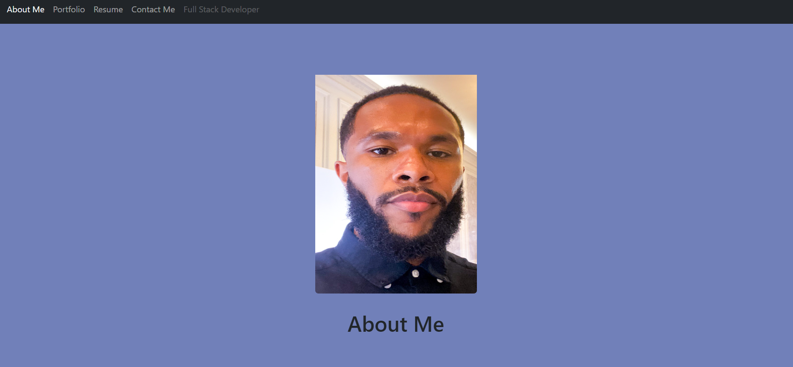
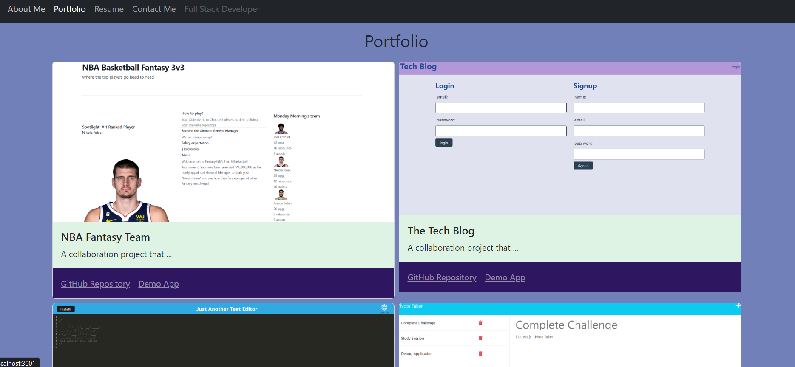
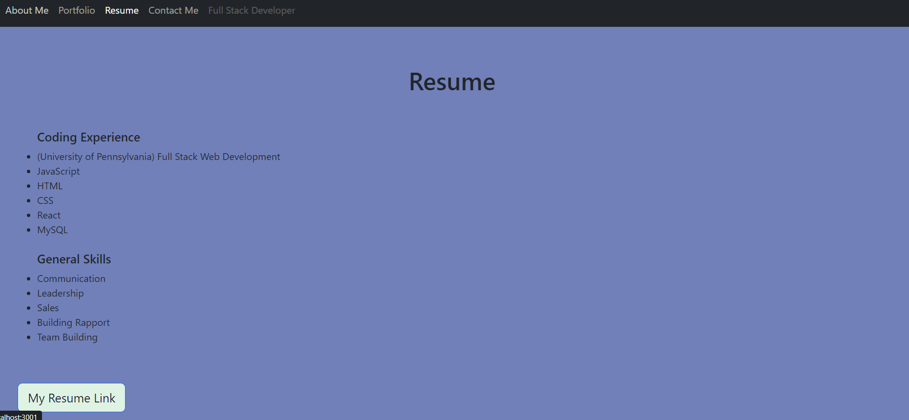
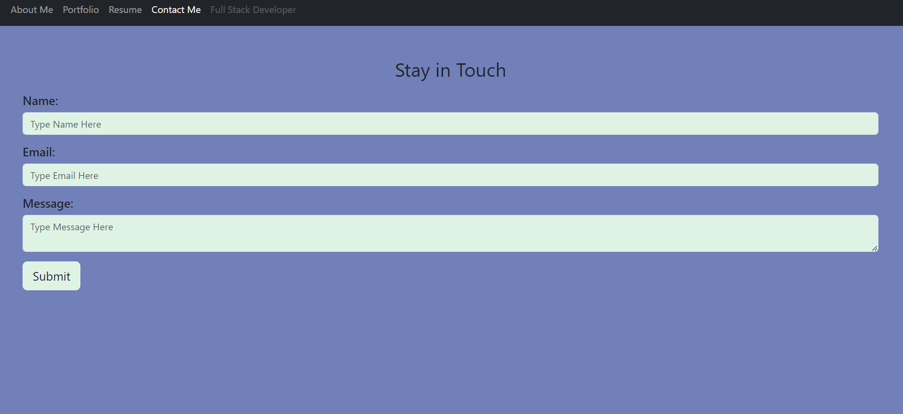

# 20 React: React Portfolio

## My Task

Being a part of a community is one of the many opportunities that comes along with being a web developer. Sharing and collaborating on projects all while seeking for the right fit in terms of jobs or freelance work comes with the territory. Sharing work with other developers and collaborating on projects is an important skill to not only have but showcase as well.

My task was to create a portfolio using my new React skills, this has helped in setting me up for success in the marketplace. This portfolio uses the latest technologies that may not be used by other candidates.

I have deployed this application to Netlify. By following the instructions in the Git Guide and consulting with the [Docs on Netlify](https://vitejs.dev/guide/static-deploy.html#netlify) I have created a build that has been deployed.

## User Story

```md
AS a candidate with experience in building single-page applications
I WANT to highlight to potential employers my deployed React portfolio of work samples
SO THAT they can assess and clearly see that I am a excellent candidate for an open position
```

## Acceptance Criteria

```md
GIVEN a portfolio for a web developer designed as a web application
WHEN I load the portfolio
THEN I am presented with a page containing a header, a section for content, and a footer
WHEN I view the header
THEN I am presented with the developer's name and navigation bar with hyperlinks to corresponding sections of the portfolio
WHEN I view the navigation titles
THEN I am introduced to the About Me, Portfolio, Contact, and Resume page options
WHEN I click on a navigation titles
THEN the browser URL changes and I am redirected to the corresponding section and that title is highlighted
WHEN I load the portfolio the first time
THEN the About Me page is selected by default
WHEN I am presented with the About Me section
THEN I see a recent photo of the developer and a short bio about them
WHEN I am presented with the Portfolio section
THEN I see project images of the developer’s applications with links to both the deployed applications and the corresponding GitHub repositories
WHEN I am presented with the Contact section
THEN I am presented a form with fields for a name, an email address, and a message
WHEN I move my cursor out of one of the form fields without entering text
THEN I receive a notification that this field is required
WHEN I enter text into the email address field
THEN I receive a notification if I have entered an invalid email address
WHEN I am presented with the Resume section
THEN I given the opportunity to view some skills of the developer and be redirected to the downloaded resume of the developer by clicking a link
WHEN I view the footer
THEN I am presented with text or icon links to the developer’s GitHub and LinkedIn profiles)
```

## Mock-Up

The following animation shows the web application's appearance and functionality that was given to me as an example to follow during development:


## Getting Started

I used `vite` to build my portfolio, which includes the following:

* A single `Header` component that appears on multiple pages

* A single `Navigation` component within the header that will use `Link` components from `react-router-dom` to conditionally render the different sections of your portfolio

* A single `Project` component that will be used multiple times in the Portfolio section

* A single `Footer` component that appears on multiple pages

**Note**: Because this application doesn’t include a back end or connect to an API, the contact form doesn't need to save this information right now. You'll add back-end functionality in the next few weeks. In the meantime, consider including your email address and phone number on the Contact page.

### Scaffolding a new `vite` application 

1. In the command line, I navigated to the desired parent folder and ran `npm create vite@latest`.

    * 🔑 *Note*: This command automatically created a sub-folder which houses my React application; the `mkdir` command was not needed to create one manually.

2. I entered the desired name of the new project folder.

3. From the first list of options, I selected the framework `React`.

4. From the second list of options, I selected the variant `JavaScript`.

5. I then `cd` into my newly created project folder and ran `npm install`.

    * Solidifying these concepts are great because I understand that in later activities we'll add additional NPM packages to our `vite` apps such as 'bootstrap', 'dotenv', and 'axios'.

6. I also ran `npm dev`/`npm run dev` and navigated to the prompted URL to see my application.

### Further customization that was recommended and implemented

1. I navigated to my `package.json` and modified the `scripts` object so that it looks like this example:

```json
  "scripts": {
    "dev": "vite",
    "start": "vite",
    "build": "vite build",
    "lint": "eslint src --ext js,jsx --report-unused-disable-directives --max-warnings 0",
    "preview": "vite preview"
  },
```

* Note the addition of the `"start": "vite"` script.

2. I navigated to the `vite.config.js` file and edited the export object so that it looks like this example:

```js
export default defineConfig({
  plugins: [react()],
  server: {
    port: 3000,
    open: true
  }
})
```

### Projects

For each of my projects that are featured in my portfolio, the following is included:

* An image of the deployed application (either a short animated GIF or screenshot)

* The title of the project

* A link to the deployed application

* A link to the corresponding GitHub repository

### Design

I know that "good" design is subjective; however, my objective and intention was to have a polished site. I followed these few guidelines on what that means:

* Used mobile-first design.

* Chose a color palette that distinguishes your site from the default Bootstrap theme and unstyled HTML sites. Referred to resources like [Coolors](https://coolors.co/) to help you create something that will stand out.

* The font size is designed to be large enough to read and colors chosen in for the purpose of avoiding eye strains.


## Review 

The following has been placed here to meet requirements for review:


Refer to this link [Netlify Deployed Application](: https://khalidgibsonportfolio.netlify.app/) to view and explore the application and functions on deployed site on Netlify

Refer to this link [GitHub Repository](https://github.com/TheKhalidGibson/ReactPortfolio) to view and explore the GitHub repo for this assignment


## Screenshots

The following images reflect the functionality and final results of development for this deployed application:

This is an image showing the About page of my portfolio


This is an image showing the Projects page of my portfolio


This is an image showing the Resume page of my portfolio


This is an image showing the Contact page of my portfolio
